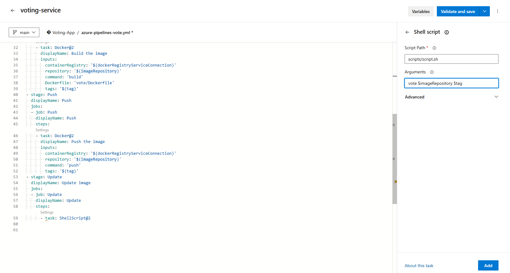

# CI/CD Pipeline with Azure DevOps, Docker, Kubernetes, and ArgoCD

This guide outlines how to set up a CI/CD pipeline using **Azure DevOps**, **Docker**, **Azure Kubernetes Service (AKS)**, and **ArgoCD**.

In this project, I am implementing **CI/CD** using **Azure** and **Azure Devops**. I am leveraging the **docker samples** GitHub repository to get source code. <a href="https://github.com/dockersamples/example-voting-app">**dockersamples/example-voting-app**</a>

## **Prerequisites**
Before you begin, ensure you have the following:
- An **Azure DevOps** account
- An **Azure Container Registry (ACR)**
- An **Azure Kubernetes Service (AKS) cluster**
- **kubectl** and **az CLI** installed
- **ArgoCD** installed in your AKS cluster

## **Step 1: Agent Configuration**
- Create a VM in Azure
- SSH into the VM 
- Install docker in the VM, as part of our pipelines we will be building and pushing docker images. "sudo apt update && sudo apt install -y docker.io"
- Grant permissions, "sudo usermod -aG docker azureuser" && "sudo chmod -R /var/run/docker.sock" && "docker ps".
- <a href="https://learn.microsoft.com/en-us/azure/devops/pipelines/agents/pools-queues?view=azure-devops&tabs=yaml%2Cbrowser"> Configuring Agent. </a>
- Follow the steps, when you run ./config.sh -> 
- Enter the server URL ->  https://dev.azure.com/{yourorganization} -> https://dev.azure.com/adityanavaneethan1998
- Create a Personal Access Token from Azure devops User settings <PERSONALACCESSTOKEN> and paste it there for authentication.
- Enter Agent Pool -> Go to Project settings -> Agent pools -> Get the Agent Pool name -> adityaagent
- Enter the Agent Name -> adityaagent
- Enter work folder => ENTER  -> Settings saved -> You should be able to see your agent listed in Agent pools (adityaagent) -> Agents
- Now run ./run.sh -> Agent will be online. 
- Now Agent is ready to be used within pipelines to execute our jobs.

## **Step 2: Azure Container Registry**
- I am building Images and Pushing images so that I can use them in by Kubernetes cluster to host the application.
- So I am creating a container registry in Azure itself. I choose Azure because I dont have to write an additional step to perform Docker authentication incase if I chose DockerHub as my container registry.

## **Step 3: Creating Pipelines**
- I am creating 3 pipelines for 3 different services. The pipeline steps can be found under pipelines/*.yml
- Result-service
- Voting-service
- Worker-service
- For Worker-service, My Pipeline was failing because the worker/Dockerfile requires an argument --platform=${BUILDPLATFORM} -> --platform=linux and remove the $TARGETARCH in all instances /-a $TARGETARCH/

## **Step 4: Create a Kubernetes Cluster**
- I am using Azure Kubernetes Service, for deploying the application.
- Create a Kubernetes cluster in Azure.
- Login into AZ Kubernetes cluster -> az login -> az aks get-credentials --name clustername --overwrite-existing --resource-group resourcegroupname
- az aks get-credentials --name votingapp --overwrite-existing --resource-group votingapp
- Install ArgoCD which will do the Continuos Deployment of our application to the kubernetes cluster.
- ArgoCD will continuosly monitor the repo containing kubernetes definition files, so that if someone manually makes any changes to the kubernetes cluster ArgoCD will instantly rever that configuration to match the configuration the remote repo.
- This gives high traceability into who made what changes and manual changes to the cluster is not allowed as with the help of ArgoCD.

## **Step 5: Installing ArgoCD in Kuberentes Cluster**
- <a href ="https://argo-cd.readthedocs.io/en/stable/getting_started/"> ArgoCD Installation </a>
- kubectl create namespace argocd
- kubectl apply -n argocd -f https://raw.githubusercontent.com/argoproj/argo-cd/stable/manifests/install.yaml
- kubectl get pods -n argocd
- kubectl get secrets -n argocd
- kubectl edit secret -n argocd argocd-initial-admin-secret
- echo "bURaWUo1OXFjVEpPVEpZMQ==" | base64 --decode  ==> mDZYJ59qcTJOTJY1
- kubectl get svc -n argocd
- kubectl edit svc -n argocd argocd-server ==> Change service type for ClusterIP to NodePort
- kubectl get svc -n argocd -> Note the port it is exposed to the internet.
- kubectl get nodes -o wide -> Note the Nodes external Ip
- Access the argocd ui http://externalip:NodePort, You wont be able to access it because of Network Settings.
- Go to Azure Virtual Machine Scale Set and allow internal traffic to the NodePort from Your IP or Anywhere.
- Login to ArgoCD, Username: Admin, Password: mDZYJ59qcTJOTJY1
- ArgoCD should be able to access our Private Azure repo, So we can use Personal Access Token that we created in Agent Configuration step.
- Now lets connect our Private repo with ArgoCD -> Go to Settings -> Repository -> Connect repo -> via HTTPS -> repo url https://adityanavaneethan1998@dev.azure.com/adityanavaneethan1998/Voting-App/_git/Voting-App -> replace organization name with (PERSONAL ACCESS TOKEN) -> https://<PERSONALACCESSTOKEN>@dev.azure.com/adityanavaneethan1998/Voting-App/_git/Voting-App
- Click Connect, It should be successful.

## **Step 6: Configuring ArgoCD**
- Once ArgoCD is able to connect to private repo, Create Application.
- New App -> Sync Policy (Automatic) -> Repo Url -> Path (k8s-specifications) -> Namespace(default)
- Right now, The image in the k8s-specification is the default one as we have not mentioned a way to change that image to use the latest image that we have built. 
- I am creating a script **script.sh** that can change the image name in k8s-specifications once after each image is built.
- Inside the script, it takes 3 arguments $1, $2, and $3. 
- I pass the arguments in the pipeline, as shown in image below
**Passing Arguments to scripts/script.sh**</img>
- Reduce ArgoCD sync time from to 10 seconds "kubectl edit -n argocd cm argocd-cm". Check **argocd-CM.yml**.
- Kubernetes wont be able to pull image from Azure Container Register since it is a private container registry.
- Let us use ImagePullSecrets to fix the permission issue.
- Go to Azure Container Register -> Settings -> Access Keys -> Admin User -> Username: votingappcontainers, Password: <Password>
- Create a secret
```bash
kubectl create secret docker-registry <secret-name> \
    --namespace <namespace> \
    --docker-server=<container-registry-name>.azurecr.io \
    --docker-username=<service-principal-ID> \
    --docker-password=<service-principal-password>
kubectl create secret docker-registry acr-secret \
    --namespace default \
    --docker-server=votingappcontainers.azurecr.io \
    --docker-username=votingappcontainers \
    --docker-password=<Password>
```
- Let us use this in the deployment.yml

## **Step 5: Cleanup & Security Best Practices**
- **Avoid storing secrets in YAML** files.
- **Use RBAC policies** for Azure and Kubernetes.
- **Enable monitoring** using Azure Monitor and Prometheus.

## **Conclusion**
This guide provides a robust CI/CD pipeline for deploying applications using **Azure DevOps, Docker, Kubernetes, and ArgoCD**. Follow best practices to ensure **security, scalability, and automation** in your deployments.

